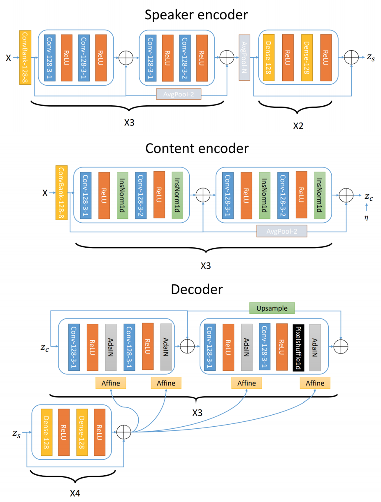

***Based on [One-shot Voice Conversion by Separating Speaker and Content Representations with Instance Normalization](https://github.com/jjery2243542/adaptive_voice_conversion)***

## I. Introduction

<figure>
    
    <figcaption>Simple Model</figcaption>
</figure>

### I-1. 논문의 아이디어

논문은 Image에서 사용하는 VAE와 IN을 사용하여 Style Transfer에 활용할 수 있다고 하며 One-Shot Voice Conversion을 제시하고 있습니다.

### I-2. 모델 설명

    

모델은 총 4가지의 파트로 구성이 되어 있습니다.

1. **Speaker Encoder** : 화자 정보를 추출합니다.
2. **Content Encoder** : Text 정보를 추출합니다.
3. **Decoder** : Content Encoder에서 받은 latent vector를 사용하여 Reconstruction합니다. 이 과정에서 speaker 정보를 Affine transform하여 AdaIN layer에 붙여서 사용합니다.

 

## II. Dataset

총 3개의 데이터셋을 사용하여 훈련하였습니다.

| Dataset     | Detail          | Hours | 화자수 | 여성 화자수 | 남성 화자수 | Format | SR    |
| ----------- | --------------- | ----- | --- | ------ | ------ | ------ | ----- |
| VCTK Corpus |                 | 44    | 109 |        |        | .wav   | 24kHz |
| LibriSpeech | train-clean-100 | 100.6 | 251 | 125    | 126    | .flac  | 16kHz |
| LibriSpeech | train-clean-360 | 363.6 | 951 | 439    | 482    | .flac  | 16kHz |

## III. Preprocessing

전처리에 필요한 hyperparameter는 동일하게 사용하였습니다.

- 음성 데이터 전체 리스트 random shuffle
- train, val, test set으로 분할 (train : val = 19 : 1)
- 각 리스트의 음원을 mel-spectrogram으로 변환 (박규봉님의 tacotron 내부 코드 사용)
- normalization을 위해 일정 길이의 데이터에서 평균과 분산값 저장 
- mel-spectrogram에서 segment size가 128 이하인 음원은 제거

## IV. 기존 논문과 코드 비교

원 저자는 기존 논문에서 제안한 방법에 몇가지 수정을 한 코드를 공유하였고, 차이점은 다음과 같습니다.

1. **기존 논문에서의 Lambda값 사용** : iter수에 따라 annealing하여 사용
2. **Reconstruction Loss Fuction** : 기존 VAE에서 사용하는 KLD Loss 사용
3. **log sigma값 사용 여부** : Inference 시, 분산값 사용안함 (사용해본 결과 악화)
4. 그 외 : Dropout 사용안함

그 외의 dummy code 등이 있었으며, 일부 제거하였습니다.

## V. Results

음원은 Griffin Lim을 사용하여 생성했습니다.

### V-1. VCTK & Demo 비교

Demo Page에서는 VCTK Dataset을 사용하여 음성을 생성하였습니다.
Github에 Pre-Trained된 모델을 공개하여, 같은 방법으로 전처리 및 훈련을 진행하였고 유사한 결과가 나오는지 체크하였습니다.

거의 Demo와 유사한 결과가 나오는 것을 확인할 수 있습니다.

<table>
    <thead>
        <th></th>
        <th>Male(seen)</th>
        <th>Femal(seen)</th>
    </thead>
    <tbody>
        <tr>
            <th>Male(Seen)</th>
            <td></td>
            <td></td>
        </tr>
        <tr>
            <th>Female(Seen)</th>
            <td></td>
            <td></td>
        </tr>
        <tr>
            <th>Male(Unseen)</th>
            <td></td>
            <td></td>
        </tr>
        <tr>
            <th>Female(Unseen)</th>
            <td></td>
            <td></td>
        </tr>
    </tbody>
</table>

### V-2. train-clean-100

<table>
    <thead>
        <th></th>
        <th>Male(seen)</th>
        <th>Femal(seen)</th>
    </thead>
    <tbody>
        <tr>
            <th>Male(Seen)</th>
            <td></td>
            <td></td>
        </tr>
        <tr>
            <th>Female(Seen)</th>
            <td></td>
            <td></td>
        </tr>
        <tr>
            <th>Male(Unseen)</th>
            <td></td>
            <td></td>
        </tr>
        <tr>
            <th>Female(Unseen)</th>
            <td></td>
            <td></td>
        </tr>
    </tbody>
</table>

### V-3. train-clean-100

<table>
    <thead>
        <th></th>
        <th>Male(seen)</th>
        <th>Femal(seen)</th>
    </thead>
    <tbody>
        <tr>
            <th>Male(Seen)</th>
            <td></td>
            <td></td>
        </tr>
        <tr>
            <th>Female(Seen)</th>
            <td></td>
            <td></td>
        </tr>
        <tr>
            <th>Male(Unseen)</th>
            <td></td>
            <td></td>
        </tr>
        <tr>
            <th>Female(Unseen)</th>
            <td></td>
            <td></td>
        </tr>
    </tbody>
</table>

## Conclusion

Mel-Spectrogram에서 보이는 것처럼 높은 주파수의 음역대에서 파형이 모두 흐릿해지는 것을 관찰할 수 있습니다.

## Future Work

- Content Encoder 대신에 Text로 전달하여 STS가 아닌 TTS로 구성